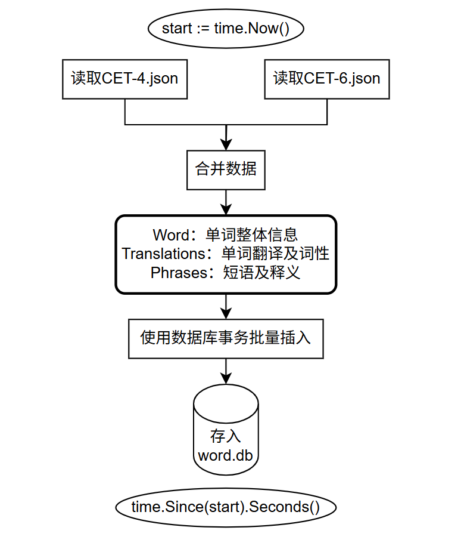

# Go语言作业 — 第三天：文件读取和处理（第二次考核）
## 整体思路
- 读取两个JSON文件(`3-CET4-顺序.json`和`4-CET6-顺序.json`)
- 提取其中的单词、翻译、词性和短语
- 使用struct储存json数据，根据json文件的结构，定义了三个sturct 
    ```
    Word：单词整体信息
    Translations：单词翻译及词性
    Phrases：短语及释义
    ```
- 在main函数开始和末尾使用 `time` 包记录程序运行时间：
    ```
    start := time.Now()
    time.Since(start).Seconds()
    ```
- 合并两个json文件，方便后续插入
- 将这些数据写入一张words表
- 由于words唯一，可以设置为主键

### 数据插入
*最开始的方法* （可见注释的SaveWords函数代码）<br>
- 对合并后的json文件进行遍历
- 将翻译放入transList
- 将词性放入typeList
- 将phrases放入phraseList
- 执行 SQL 插入或更新
- 插入时会对word进行判断，如果word已经存在就进行更新替换，若word不存在就进行插入

**现有方法** <br>
- 在对go语言学习的过程中，了解到了事务的概念
- 使用事务批量插入
  - 提升性能
  - 保证数据一致性
- 插入时仍然判断 word 是否存在，存在就更新，不存在就插入


### 表设计
1. words 表（存储单词本体）

| 字段名 | 类型  | 说明       |
|--------|-------|------------|
| word   | TEXT  | 单词内容   |

---

2. translations 表（存储单词对应的翻译和词性）

| 字段名      | 类型  | 说明       |
|-------------|-------|------------|
| word        | TEXT  | 对应单词   |
| translation | TEXT  | 翻译内容   |
| type        | TEXT  | 词性       |

---

3. phrases 表（存储单词对应的短语及释义）

| 字段名            | 类型  | 说明       |
|------------------|-------|------------|
| word             | TEXT  | 对应单词   |
| phrase           | TEXT  | 短语内容   |
| phrase_translation | TEXT  | 短语释义   |

## 代码亮点
- 使用事务批量插入，提升了性能，缩短了运行时间
- 将数据进行规范化存储，分别拆分为 words、translations、phrases 三张表，方便后续管理与查询
- 保证数据唯一性与完整性：
  - words 表中每个单词仅存储一次，作为主键
  - translations 表和 phrases 表通过外键与 words 表关联
- 插入前自动判断 word 是否存在，存在不重复插入
- 插入语句关键代码：
  ```
  INSERT OR REPLACE INTO words(word, translation, type, phrase) VALUES (?, ?, ?, ?)
  ```
  若遍历到的 word 不存在，则直接插入<br>
  若遍历到的 word 已存在，对原始数据进行更新替换<br>

## 流程图


## 代码运行
方式一：直接运行
```
cd week03\homework\fileprocessing\
go run .\main.go
```

方式二：编译成可执行文件运行

```
cd week03\homework\fileprocessing\
go build .\main.go
.\main.exe
```
